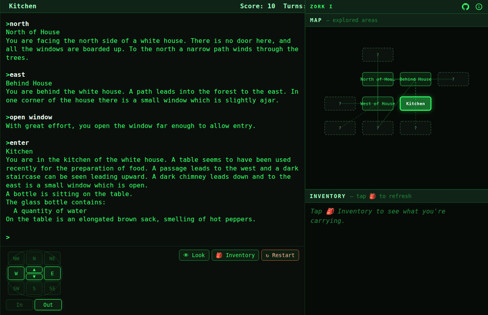

# Zork I — The Great Underground Empire

The **entire, original Zork I** running in your browser and in your terminal —
powered by Microsoft's MIT-licensed ZIL, compiled to Z-machine bytecode, and
executed by a TypeScript Z-machine interpreter.

▶ **Play in the browser: https://ashleydavis.github.io/zork/**

By [Ashley Davis](https://codecapers.com.au/) — read more on my blog,
[codecapers.com.au](https://codecapers.com.au/).



## What this is

In 2025 Microsoft [open-sourced the original Infocom source code for Zork I, II
and III](https://opensource.microsoft.com/blog/2025/11/20/preserving-code-that-shaped-generations-zork-i-ii-and-iii-go-open-source/)
under the MIT license, at
[github.com/historicalsource/zork1](https://github.com/historicalsource/zork1).

That source is written in **ZIL** (Zork Implementation Language). ZIL is not
interpreted directly — Infocom's tools compiled it into bytecode for a virtual
machine called the **Z-machine**. The Microsoft repo ships both the ZIL source
*and* the compiled result (`COMPILED/zork1.z3`).

This project takes that compiled game and runs it on a **Z-machine interpreter
written in TypeScript/JavaScript** ([ifvms](https://github.com/curiousdannii/ifvms),
the engine behind Parchment), wrapped in two front-ends:

```
zork1.zil            Microsoft's MIT-licensed ZIL source  (game/zork1.zil, for provenance)
   │  (Infocom's compiler produced …)
   ▼
zork1.z3             the compiled game — real Z-machine v3 bytecode  (game/zork1.z3)
   │  executed by
   ▼
ifvms Z-machine      a TypeScript/JS Z-machine interpreter
   │  driven through the Glk I/O layer (glkapi) by
   ├── cli/zork.mjs        → terminal front-end (bun)
   └── web/                → browser front-end (Vite): custom GlkOte terminal UI
```

Because it runs the *actual* compiled game, this is not a re-implementation —
it is Zork I, byte for byte (Release 119 / Serial 880429), with the complete
map, parser, thief, combat, puzzles, and scoring.

## Play in the terminal

Requires [Bun](https://bun.sh).

```sh
bun install
bun run play
```

You'll get the classic prompt:

```
West of House
You are standing in an open field west of a white house, with a boarded
front door.
There is a small mailbox here.

>
```

You can also point it at any other Z-machine v3–8 story file:

```sh
bun cli/zork.mjs path/to/other-game.z5
```

## Play in the browser (local dev)

```sh
bun install
bun run dev       # start Vite dev server
bun run build     # production build → web/dist
bun run preview   # preview the production build
```

The web front-end is a self-contained "glass terminal": a status line (the
Z-machine *grid* window), a scrolling transcript (the *buffer* window), and a
command input. Save/Restore work in-browser via `localStorage`.

The shell is **React + MUI**, responsive for desktop and mobile, while the
Z-machine engine stays vanilla and imperative (React just hosts and relocates
its DOM). Companion features (browser only — the terminal itself is untouched):

- **Fog-of-war automap** — rooms are drawn as you visit them, with
  adjacent-but-unexplored rooms shown as dim "?" fog nodes; the current room
  glows. Desktop: right panel. Mobile: a drawer that slides up from the bottom.
- **Inventory panel** — parsed from the game's own `inventory` output. Desktop:
  under the map. Mobile: a drawer that slides in from the right.
- **Button bar** — all direction buttons (compass rose + up/down/in/out, with
  the current room's real exits highlighted), plus Look / Inventory / Restart.
  Buttons just submit commands; typing still works exactly as before.
- **About dialog** — links to this repo and the author's blog.
- **A victory celebration** when you finish the game. 🎉 (There may or may not
  be a secret way to preview it.)

## The map (`data/map.yaml` / `data/map.json`)

`tools/zil-to-yaml.mjs` parses Microsoft's `1dungeon.zil` — the exact ZIL our
`zork1.z3` was compiled from — into a complete map of all **110 rooms** and
**352 exits**, capturing normal, conditional (`if: WON-FLAG`), door
(`if: "TRAP-DOOR IS OPEN"`), blocked (with message) and routine (`per`) exits,
plus each room's flags, globals, description and action. Regenerate with:

```sh
bun run map
```

## How the browser front-end works

The interesting glue lives in `web/src`:

- **`web-glkote.js`** — a minimal implementation of the
  [GlkOte](https://eblong.com/zarf/glk/glkote/docs.html) display protocol for
  the DOM. The Z-machine talks Glk; this translates Glk window updates into DOM
  and turns keystrokes back into Glk input events.
- **`web-dialog.js`** — a `localStorage`-backed Dialog so SAVE / RESTORE work
  without a filesystem.
- **`main.js`** — fetches `zork1.z3`, wires the ifvms VM to `glkapi` + our
  display, and starts the game.

`glkapi.js` (the shared Glk API library) is loaded as a classic script because
it predates modules and relies on sloppy-mode globals; everything else is
bundled by Vite.

## Deployment

`.github/workflows/deploy.yml` builds the Vite app with `bun` and publishes
`web/dist` to GitHub Pages on every push to the default branch.

> First-time setup: enable Pages once at **Settings → Pages → Source: GitHub
> Actions**. (The Actions token cannot enable Pages itself.)

## Licenses & credits

- **Zork I** — ZIL source and compiled `zork1.z3`: © Infocom, released by
  **Microsoft under the MIT License** (see `game/MICROSOFT-LICENSE.txt`).
  <https://github.com/historicalsource/zork1>
- **ifvms** (Z-machine interpreter) and **glkote-term** / **glkapi** — MIT,
  © Dannii Willis and contributors.
  <https://github.com/curiousdannii/ifvms>
- This project's own code (CLI, web front-end, GlkOte/Dialog shims) — MIT.

ZORK is a trademark of Infocom / Activision. This is a preservation/education
project built on officially open-sourced code.
